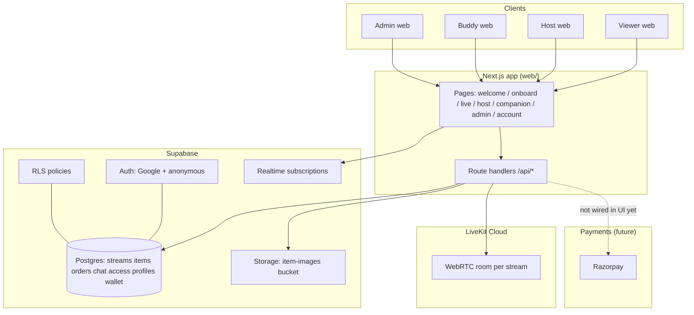
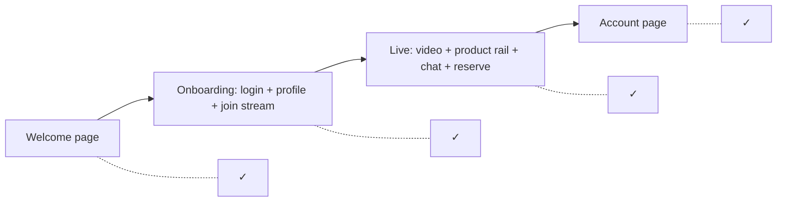
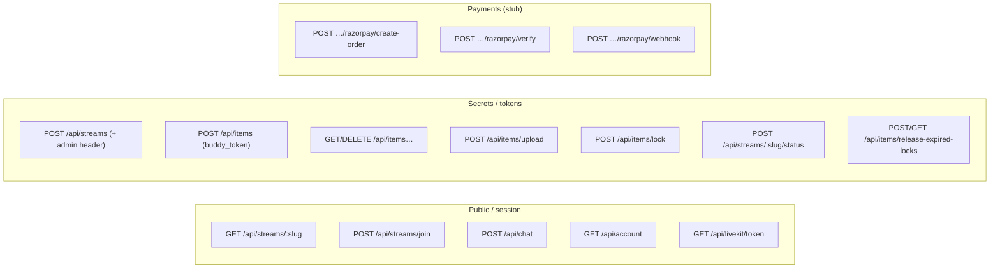

# Jini Live — architecture & status map

Use this file in GitHub, VS Code (Mermaid preview), or paste into [mermaid.live](https://mermaid.live).

---

## 1) System overview (what talks to what)

---

## 2) Viewer journey (happy path)

---

## 3) Done vs remaining (checklist style)

Legend: **✓** = implemented in this repo (may still need your keys / deploy). **☐** = not done / empty for you to fill as you prioritize.

```mermaid
flowchart TB
  subgraph DONE["✅ Done (in codebase)"]
    direction TB
    d1["Core schema + RLS + migrations 001–004 ✓"]
    d2["Stream create / join / slug metadata ✓"]
    d3["Buddy: publish / list / remove items, cap 4 ✓"]
    d4["Image URL + upload to Supabase Storage ✓"]
    d5["Viewer live: LiveKit video + product rail realtime ✓"]
    d6["Reserve item lock + pending order + hold message ✓"]
    d7["Release expired locks API + heal-on-lock ✓"]
    d8["Chat via server API + display names (no phone in chat) ✓"]
    d9["Google + Skip Google (anon) auth ✓"]
    d10["Admin: links + recent streams + mark live / end ✓"]
    d11["Mobile: chat drawer + horizontal rail + safe areas ✓"]
    d12["Welcome / onboarding copy + touch-friendly forms ✓"]
    d13["Account page + wallet tables (balance display) ✓"]
    d14["Razorpay: create-order / verify / webhook stubs ✓"]
  end

  subgraph LEFT["☐ Remaining (empty — fill as you go)"]
    direction TB
    l1["☐"]
    l2["☐"]
    l3["☐"]
    l4["☐"]
    l5["☐"]
    l6["☐"]
    l7["☐"]
    l8["☐"]
  end
```

### Suggested labels for the empty `☐` boxes (copy into your roadmap)

| Slot | Typical next work |
|------|-------------------|
| `l1` | Razorpay Checkout on “Yours” + mark order paid + item sold |
| `l2` | Wallet top-up from payment + ledger writes |
| `l3` | Hosted **deploy** (Vercel etc.) + env + domain |
| `l4` | **Cron** calling release-expired-locks every minute |
| `l5` | Order history / “my reservations” UI |
| `l6` | Inline edit profile & multiple addresses |
| `l7` | Moderation: slow mode, ban, link filtering |
| `l8` | Analytics, error monitoring (e.g. Sentry), rate limits |

To turn a slot into a visible node in Mermaid, replace `" "` with e.g. `["Razorpay checkout UI ☐"]`.

---

## 4) API surface (mental model)

---

*Generated for the Jini MVP web app. Edit `LEFT` nodes as you ship features.*
